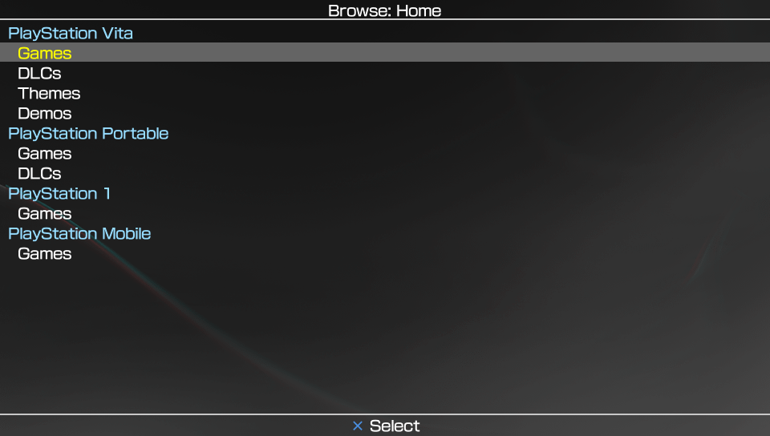
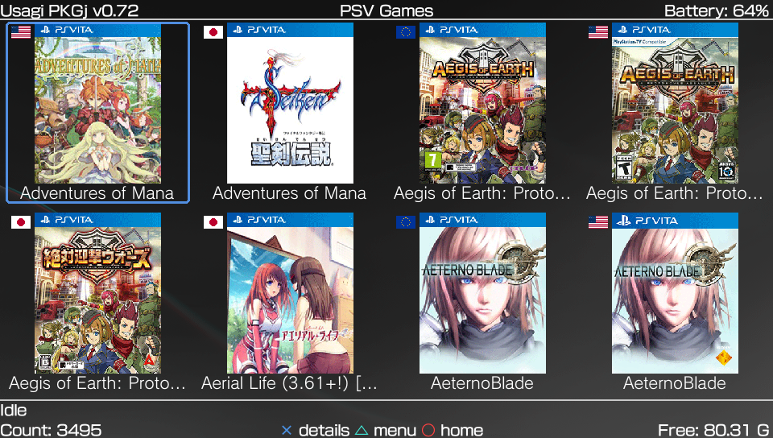
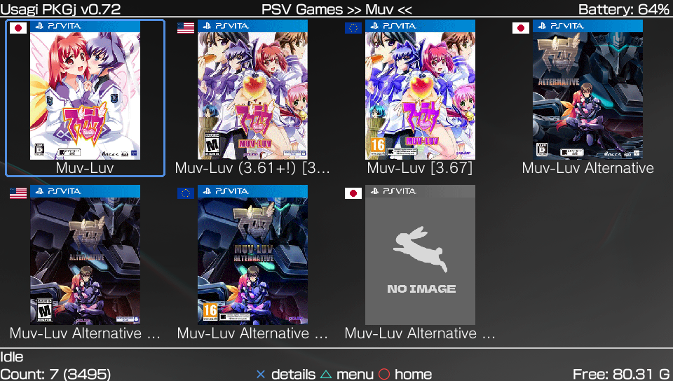
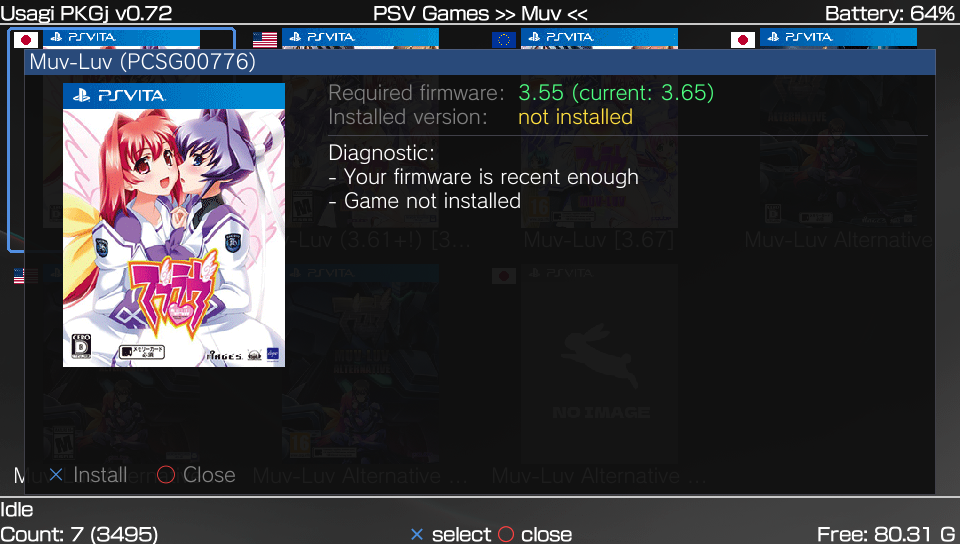
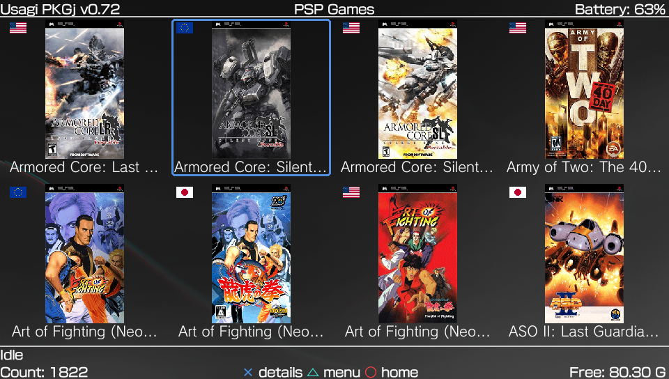
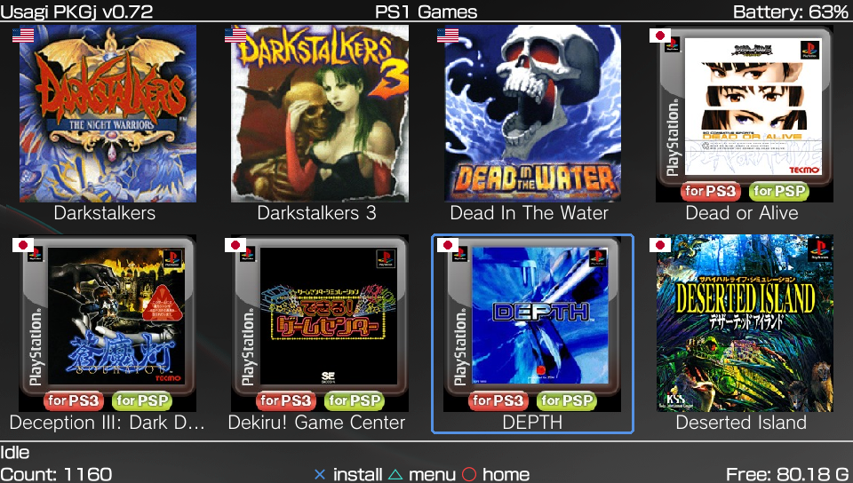
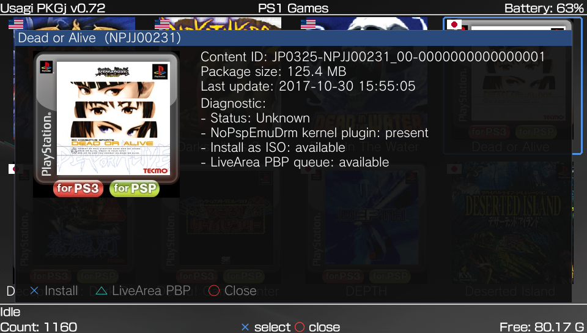

# Usagi PKGj

[![Downloads][img_downloads]][pkgj_downloads] [![Release][img_latest]][pkgj_latest] [![License][img_license]][pkgj_license]

Usagi PKGj is a fork of [blastrock/pkgj][pkgj_upstream] — the homebrew that lets you download & unpack PKG files directly on Vita together with your [NoNpDrm][] or [NoPsmDrm][] fake license. PSP content can be played using [Adrenaline][] or directly from LiveArea using [NoPspEmuDrm][].

This fork's main addition is a **cover-art grid view** for browsing PS Vita, PSP, and PSX games — see below.

# Features

* **works on** all PS Vita models, including PSTV.
* **cover-art grid view** for PS Vita, PSP, and PSX games — see [Cover art](#cover-art) below.
* **easy** way to see list of available downloads, including searching, filter & sorting.
* **standalone**, no PC required, everything happens directly on Vita.
* **automatic** download and unpack, just choose an item, and it will be installed, including bubble in live area.
* **background downloads**, now supports native bgdl function, so you can do whatever you want on the console while content is downloading.
* **queues** multiple downloads.
* **supports** the TSV file format.
* **installs** Game Updates, DLCs, Demos, Themes, PSM, PSP games, PSP DLCs, and PSX games.

# Screenshots

<table>
  <tr>
    <td align="center"><strong>Browse Home</strong><br></td>
    <td align="center"><strong>PS Vita Grid</strong><br></td>
  </tr>
  <tr>
    <td align="center"><strong>Grid Filters</strong><br></td>
    <td align="center"><strong>PS Vita Details</strong><br></td>
  </tr>
  <tr>
    <td align="center"><strong>PlayStation Portable Grid</strong><br></td>
    <td align="center"><strong>PlayStation Portable Install</strong><br></td>
  </tr>
  <tr>
    <td align="center"><strong>PlayStation 1 Grid</strong><br></td>
    <td align="center"><strong>PlayStation 1 Details</strong><br></td>
  </tr>
</table>

# Download

Get latest version as [vpk file here][pkgj_latest].

# Usage

Make sure unsafe mode is enabled in Henkaku settings.

Use the Home screen to choose a content section, then select an item to open its details page. The footer always shows the available PlayStation button actions for the current screen.

For general PKGj usage, TSV sources, search/filter behavior, and base download flow details, see the [upstream PKGj repository][pkgj_upstream].

## Cover art

The PS Vita, PSP and PSX games lists are browsed as a grid of cover art by default instead of the plain text list — toggle **"Grid view (games)"** in the triangle options menu to switch back.

Covers are fetched on demand, one at a time, and cached locally so they only need to download once:

1. By default, box art from the [HexFlow-Covers][hexflow_covers] project is tried first (vertical for PS Vita/PSP, square for PSX).
2. If a title isn't in that set, it falls back to the cover from the PlayStation Store.

# Configuration

Usagi PKGj is shipped with valid default URLs. Settings can be configured through `ux0:usagi-pkgj/config.txt` or `ur0:usagi-pkgj/config.txt`.

For inherited PKGj options such as `url_games`, `url_dlcs`, `url_psp_games`, and `no_version_check`, see the [upstream PKGj repository][pkgj_upstream].

| Option | Description |
| --- | --- |
| `grid_view 0` | Show the games list as a plain text list instead of the cover-art grid (grid is the default) |
| `thumbnail_folder <path>` | Local folder covers are cached in (default: `ux0:usagi-pkgj/cover`) |
| `install_psp_as_pbp 1` | Install PSP games as EBOOT.EBP files instead of ISO files (see Troubleshooting) |
| `install_psp_psx_location uma0:` | Install PSP and PSX games on `uma0:` |

# Troubleshooting

For general PKGj usage questions, see the [upstream PKGj repository][pkgj_upstream].

## Interrupted downloads

For PS Vita content, remove the queued download from LiveArea. If that does not work, delete the matching folder under `ux0:bgdl/t/`.

For PSP, PSX, and other direct downloads, delete the matching title folder under `ux0:usagi-pkgj`.

## PSP LiveArea installs

To queue PSP games in LiveArea and launch them outside Adrenaline, install the [NoPspEmuDrm][] plugin. This path installs PSP games as EBOOT/PBP files.

Without that plugin, PSP games are downloaded directly by Usagi PKGj and installed as ISO files for Adrenaline.

## PSP EBOOT/PBP installs

Installing PSP games as EBOOT/PBP can be faster and use less space, but it requires the [npdrm_free][] plugin.

To prefer EBOOT/PBP installs, add this to your config:

```
install_psp_as_pbp 1
```

To switch back, remove the line from the config file.

## Cover cache

Covers are cached under `ux0:usagi-pkgj/cover` by default. Delete that folder if you want Usagi PKGj to fetch cover art again.

# Building

See [DEVELOPMENT.md](DEVELOPMENT.md) for full build instructions (host simulator + Vita `.vpk`), the CI pipeline, and a summary of what this fork changes versus upstream.

For base PKGj build context, see the [upstream PKGj repository][pkgj_upstream].

# Publishing a release (for maintainers)

Pushing a tag in the form `0.72` runs the release workflow, builds the Vita and host artifacts, and publishes a GitHub Release.

Tags containing `alpha`, `beta`, or `rc` are published as pre-releases.

# AI-assisted development

AI-assisted tools were used during the development of Usagi PKGj to help with code suggestions, debugging, refactoring, research, and documentation. 

All generated suggestions and changes were reviewed, adapted, and tested by the project maintainer.

# License

This software is released under the 2-clause BSD license.

puff.h and puff.c files are under [zlib][] license.

[NoNpDrm]: https://github.com/TheOfficialFloW/NoNpDrm/releases
[npdrm_free]: https://github.com/kyleatlast/npdrm_free/releases
[NoPsmDrm]: https://github.com/frangarcj/NoPsmDrm/
[NoPspEmuDrm]: https://github.com/LiEnby/NoPspEmuDrm
[Adrenaline]: https://github.com/TheOfficialFloW/Adrenaline
[zlib]: https://www.zlib.net/zlib_license.html
[pkgj_upstream]: https://github.com/blastrock/pkgj
[hexflow_covers]: https://github.com/Andiweli/HexFlow-Covers
[pkgj_downloads]: https://github.com/coelhomarcus/usagi-pkgj/releases
[pkgj_latest]: https://github.com/coelhomarcus/usagi-pkgj/releases/latest
[pkgj_license]: https://github.com/coelhomarcus/usagi-pkgj/blob/master/LICENSE
[img_downloads]: https://img.shields.io/github/downloads/coelhomarcus/usagi-pkgj/total.svg?maxAge=3600
[img_latest]: https://img.shields.io/github/release/coelhomarcus/usagi-pkgj.svg?maxAge=3600
[img_license]: https://img.shields.io/github/license/coelhomarcus/usagi-pkgj.svg?maxAge=2592000
